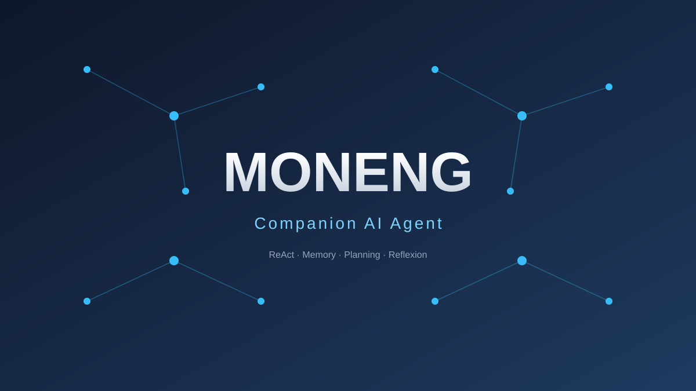

# MONENG · 陪伴型智能体



从零构建陪伴型智能体系统。当前进度：**底座 ✅ → 骨架 ✅ → 四大模块 ✅ → 循环进阶 ✅ → RAG 知识库 ✅**。

> English: [README.en.md](README.en.md)

## 项目结构

```
alita/
├── main.py                 # 入口：多轮对话 + plan 规划模式
├── demo.py                 # 演示脚本（4 场景，截图做作品集）
├── banner.svg              # 封面图
├── RESUME.md               # 简历项目描述
├── requirements.txt
├── .env.example            # 配置模板（复制为 .env 填密钥）
├── memory.json             # 长期记忆（运行时自动生成）
├── docs/                   # 把 .txt/.md 文档放这里，启用知识库检索
└── alita/
    ├── __init__.py
    ├── config.py           # 单一配置入口 + 日志
    ├── agent.py            # ★ MONENGAgent：引擎+会话+画像+记忆+规划
    ├── core/
    │   ├── llm.py          # LLM 客户端（chat + stream）
    │   ├── tools.py        # 工具结构 + 注册表
    │   ├── session.py      # 短期记忆
    │   └── agent.py        # ★ ReActAgent 引擎
    ├── modules/
    │   ├── profile.py      # ★ Profile 画像
    │   ├── memory.py       # ★ Memory 长期记忆
    │   └── planning.py     # ★ Planning 任务拆解 + 反思
    └── tools/
        ├── builtin.py      # 内置工具
        └── knowledge.py    # ★ RAG 知识库检索
```

## 快速开始

```bash
pip install -r requirements.txt
copy .env.example .env        # 编辑 .env 填入 LLM_API_KEY
python main.py                # 交互对话
python demo.py                # 4 场景演示（截图用）
```

## 两大模式

| 模式 | 命令 | 引擎 | 适用 |
|------|------|------|------|
| 对话 | 直接输入 | ReAct | 闲聊、简单问答、单步任务 |
| 规划 | `plan <任务>` | Plan-and-Execute + Reflexion | 复杂多步任务 |

## 核心能力

- **ReAct 循环**：Thought → Action → Observation，手写引擎
- **三层记忆**：短期（会话）/ 长期（JSON 持久化）/ 工作（执行草稿）
- **Plan-and-Execute + Reflexion**：拆解 → 执行 → 反思改进
- **RAG 知识库**：把文档放进 `docs/`，MONENG 即可检索回答（`search_docs` 工具）

## 9 个工具

`calculator` 计算 · `current_time` 时间 · `get_weather` 天气 · `read_file` 读文件 · `search_web` 联网搜索 · `get_http` 抓网页 · `save_memory` 记记忆 · `recall_memory` 忆记忆 · `search_docs` 知识库检索

## 四大模块

| 模块 | 状态 | 文件 | 职责 |
|------|------|------|------|
| Profile 画像 | ✅ | `modules/profile.py` | 决定 MONENG 是谁 |
| Memory 记忆 | ✅ | `modules/memory.py` | 三层记忆，长期记忆持久化 |
| Planning 规划 | ✅ | `modules/planning.py` | 任务拆解 + 反思 |
| Action 行动 | ✅ | `core/tools.py` + `tools/` | 9 个工具 + RAG 检索 |

## 架构思想

system prompt = **人设段** + **记忆段** + **能力段(ReAct)** + **工具清单**

每个模块只注入自己那一段，互不依赖、独立替换。

## 升级方向

- 记忆检索 → 向量检索（embedding + ChromaDB）
- 知识库检索 → 向量语义匹配
- 加更多工具（发送邮件、操作数据库等）
